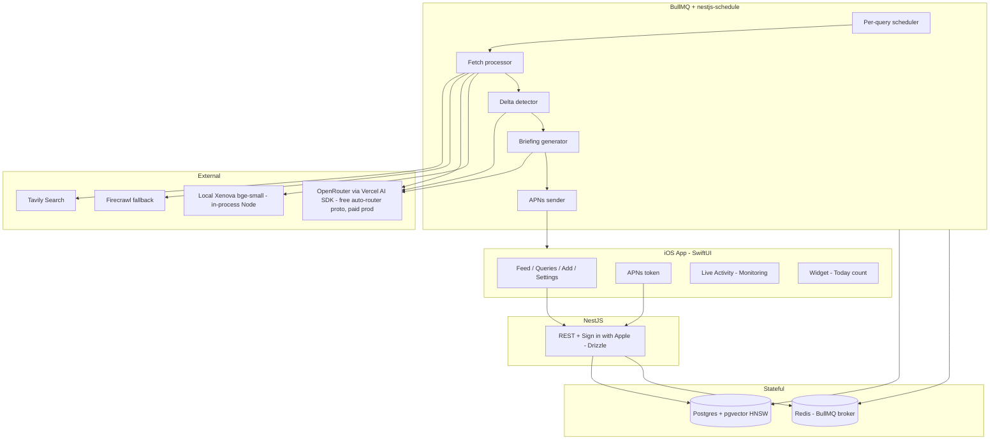

# BriefIQ — iOS App + Backend Architecture

> Question-driven AI briefing system. Native iOS client, AI orchestration backend, push only on real signal.

---

## Overall architecture: native iOS + NestJS monolith

**A. Native SwiftUI iOS + NestJS (TypeScript) monolith on Fly.io (managed Postgres + Redis, BullMQ workers, Tavily search, OpenRouter LLM gateway).** I started skeptical: native locks you to one platform, and a long-running Node container pays for idle CPU on a workload that's mostly cron-driven. SwiftUI also has a steeper learning curve than RN if you've never shipped an iOS app. But every time I walked through the actual product surface it kept reinforcing the same thing — the differentiating UX is iOS-only platform glue: APNs that "only fires on real signal" (Focus mode integration, interruption levels), Live Activities for the "currently monitoring" reassurance loop, WidgetKit for ambient daily count, App Intents/Siri for "what changed today", quiet hours that respect the system's Sleep Focus. These ARE the product, not skin. Backend-side, NestJS gives us Spring-like structure (modules, DI, guards, pipes) for a serious AI app, TypeScript end-to-end type safety from DB through HTTP to LLM schemas, BullMQ for the strongest Redis queue in any language, and `@nestjs/schedule` for cron without separate processes. By the end I'm confident: this is the shortest path from idea to a user opening the app and feeling the philosophy land — for a Node/TS-native builder.

**B. React Native (Expo) cross-platform + AWS serverless (Lambda + EventBridge + DynamoDB + SNS).** Sounds responsible — one codebase ships to iOS and (eventually) Android, and serverless scales to zero on a workload that's 95% idle. Expo's dev loop is fast and OTA updates are real. But the more I trace the user journey, the worse it fits. Push in RN means OneSignal/Notifee — extra vendor, quirky entitlement setup. Live Activities and Widgets in RN are second-class via expo-modules and lag iOS releases by months; for an app whose entire pitch is "silence + ambient reassurance" that's a tax on the core idea. AI orchestration across Lambdas means Step Functions or hand-rolled state machines bumping against the 15-min execution cap; cold starts hurt user-triggered "Analyze with AI →" responsiveness; DynamoDB's query model fights the timeline/history views; local dev is LocalStack/sst, workable but not joyful.

**Verdict: A wins decisively.** Native iOS is where the product's defining surfaces live (push, Live Activities, Widgets, Focus, Siri). A NestJS monolith gives the AI loop structure + type safety end-to-end. The backend stays platform-agnostic, so an Android client later is additive, not a rewrite.

---

## Vector store: pgvector vs ChromaDB (revisited)

**Considered ChromaDB / Qdrant (dedicated vector DB).** Tempting because tutorials make it look "AI-native" and dedicated engines win on synthetic benchmarks. But every BriefIQ vector lookup carries relational filters (`user_id`, `query_id`, `created_at >`, dedup against shown briefings). A separate vector DB forces two round-trips, race conditions on mid-write rows, sync drift on deletes, two backup pipelines, and a second stateful service. Speed claim doesn't survive contact with our scale (~1.5M vectors max at 10k users × 5 queries × 30 snapshots — trivial for any engine).

**pgvector inside the existing Postgres wins.** Same connection pool, same transaction, same backup, same WAL, same RLS. HNSW (`pgvector ≥ 0.5`) gives sub-10ms similarity at our scale. SQL JOINs express "similarity AND user_id AND recency" as one optimized query. **Drizzle ORM** has first-class `vector('embedding', { dimensions: 384 })` type — Prisma needs `Unsupported("vector")` + raw SQL, which is why Drizzle wins for pgvector. Only worry-trigger is past ~50M vectors, which is 30× beyond plausible 5-year scale. **If we ever outgrow it, migrate to Qdrant — not Chroma.** Qdrant is the production-grade dedicated option.

---

## Backend framework: FastAPI considered, NestJS chosen

**Considered Python + FastAPI.** Mature AI ecosystem (every new LLM/agent primitive lands in Python first), `instructor` is the gold standard for structured outputs, `sentence-transformers` runs local embeddings at ~50ms/sentence with zero ceremony, SQLAlchemy + asyncpg + pgvector is tightly typed, Celery + Beat is battle-tested. Lighter ceremony than NestJS for solo prototypes.

**Chose NestJS (TypeScript).** Selected for builder ergonomics and end-to-end type safety:
- **TypeScript through and through.** One language from DB schema (Drizzle types) through HTTP DTOs (class-validator) through LLM schemas (Zod) through iOS API contracts (shared types if you bundle a generator). Compile-time guarantees Python can't match.
- **NestJS structure.** Modules, DI, guards, pipes, interceptors — the framework forces clean boundaries. Spring-like discipline that scales from solo to team.
- **BullMQ.** The most polished Redis-backed queue in any language. Beats Celery on observability (Bull Board UI), simplicity (one process), and reliability semantics.
- **`@nestjs/schedule`.** Per-query cron jobs without a separate Beat process — one container does web + worker + cron during prototype, scale apart later.
- **Vercel AI SDK.** `generateObject` with a Zod schema gives type-safe structured LLM output that rivals `instructor` in DX. Streaming, tool calling, all built in. Same OpenRouter base URL pattern.

**Two real costs being accepted:**
1. **Node AI ecosystem trails Python by 3-9 months.** `instructor-js` lags, `langgraph-js` is younger, `dspy` and `outlines` lack first-class TS equivalents. For BriefIQ's scope (a handful of well-structured prompts) this likely never bites; document it as a constraint for future agentic features.
2. **Embeddings in Node need `@xenova/transformers`.** Slower than Python's `sentence-transformers` (~200-400ms vs ~50ms per sentence) and ONNX-runtime adds ~100MB to the container. At BriefIQ load (<10 sentences embedded per cycle) this is invisible. One-line fallback to OpenAI `text-embedding-3-small` (~$0.02/1M tokens, effectively free at prototype scale) if Xenova ever annoys.

If we later want stronger AI ergonomics, we could break out a tiny Python sidecar service for embeddings/agentic graphs and keep NestJS as the API + worker orchestrator.

---

## Prototype LLM strategy: OpenRouter free models via Vercel AI SDK

**Pattern: OpenRouter as an OpenAI-compatible gateway via Vercel AI SDK.** All LLM code uses `@ai-sdk/openai` with `baseURL=https://openrouter.ai/api/v1` and the model name in an env var. Swap free ↔ paid by changing one variable. No code change ever.

**Default model for prototype: `openrouter/free`** — an auto-router (live April 2026) that picks any currently-available free model matching requested features (tool calling, structured outputs). Survives individual model deprecation; you don't touch code when DeepSeek-V3-free disappears and Qwen3 takes its slot.

**Pinned cascade (deterministic fallback):**
```
1. deepseek/deepseek-chat:free        # strongest free, excellent JSON/tool use
2. qwen/qwen3-coder-480b:free          # strong fallback
3. openai/gpt-oss-20b:free             # tertiary, native tool use, open-weight
```

**Free tier limits (verified April 2026):**
- 20 req/min globally across all free models
- 200 req/day unfunded account
- **1,000 req/day after a one-time $10 deposit** (deposit stays as paid-model credit)
- 429 on overage → exponential backoff + cascade to next free model

**Prototype load math:** 1–2 test queries × daily cycle × 3 LLM calls/cycle = 3–6 calls/day. Comfortably under unfunded limit. Funded limit covers ~50 active queries.

**Structured output via Vercel AI SDK + Zod:**
```ts
import { generateObject } from 'ai';
import { createOpenAI } from '@ai-sdk/openai';
import { z } from 'zod';

const router = createOpenAI({
  baseURL: process.env.LLM_BASE_URL,        // https://openrouter.ai/api/v1
  apiKey: process.env.LLM_API_KEY,
});

const QueryUnderstanding = z.object({
  intent: z.enum(['trend', 'event', 'policy', 'listing', 'price']),
  signal_definition: z.string(),
  suggested_sources: z.array(z.string()).max(5),
  suggested_frequency: z.enum(['hourly', 'daily', 'weekly']),
});

const { object } = await generateObject({
  model: router(process.env.LLM_MODEL!),     // openrouter/free
  schema: QueryUnderstanding,
  prompt: userQuery,
});
```

**Embeddings: `@xenova/transformers` + bge-small (default, free)** — ONNX-quantized model runs in Node on CPU. ~200-400ms/sentence, 384-dim vectors, zero rate limit, zero cost.
```ts
import { pipeline } from '@xenova/transformers';
const embedder = await pipeline('feature-extraction', 'Xenova/bge-small-en-v1.5');
const output = await embedder(text, { pooling: 'mean', normalize: true });
const vec = Array.from(output.data);  // 384 numbers, ready for pgvector
```
One-line swap to paid: replace with `embed` from Vercel AI SDK pointing at `text-embedding-3-small` (~$0.02/1M tokens).

**Production switch (one line):**
```bash
# .env.prototype
LLM_MODEL=openrouter/free
LLM_BASE_URL=https://openrouter.ai/api/v1
LLM_API_KEY=sk-or-v1-...

# .env.production
LLM_MODEL=anthropic/claude-3.5-sonnet
# (still via OpenRouter, or switch baseURL to native Anthropic SDK)
```

---

## System diagram



---

## Stack

**iOS client**
- Swift 6, SwiftUI, iOS 17+ minimum
- Observation framework, async/await, `URLSession` directly (no Alamofire needed)
- SwiftData for local cache of feed/queries (offline read)
- ActivityKit (Live Activity), WidgetKit, App Intents (Siri), UserNotifications
- Sign in with Apple (`AuthenticationServices`)
- Test: XCTest + ViewInspector for views

**Backend**
- **Node 20 LTS, TypeScript 5, NestJS 10**
- **Drizzle ORM** + `drizzle-orm/pg-core` (first-class pgvector type)
- **class-validator + class-transformer** for HTTP DTOs (NestJS-native validation pipe)
- **Zod** for LLM structured-output schemas (Vercel AI SDK)
- **BullMQ** via `@nestjs/bullmq` for queues; **`@nestjs/schedule`** for cron
- **`@parse/node-apn`** for APNs HTTP/2
- Postgres 16 + `pgvector` extension (HNSW index), Redis 7. **Not** ChromaDB/Qdrant — pgvector is correct at our scale.
- **LLM gateway: Vercel AI SDK (`ai`, `@ai-sdk/openai`)** pointed at OpenRouter. Prototype: `openrouter/free` auto-router. Production: swap env var.
- **Embeddings: local `@xenova/transformers` + `Xenova/bge-small-en-v1.5`** (ONNX, 384-dim, CPU). No API key, no rate limit. Swap to `embed()` + `text-embedding-3-small` in production if needed.
- Search: Tavily AI Search API via `@tavily/core` (primary). Firecrawl via `@mendable/firecrawl-js` for deep-scrape fallback.
- Auth: `apple-signin-auth` for identity token verify + `@nestjs/jwt` for session
- Hosting: Fly.io (one `web` machine, one `worker` machine — cron lives in `web` via `@nestjs/schedule` for prototype), Neon/Supabase Postgres, Upstash Redis
- Observability: `@sentry/nestjs`, Pino logger via `nestjs-pino`; OTEL → Grafana Cloud later

---

## Data model

```sql
users(id, apple_sub, email, push_token, quiet_start, quiet_end,
      digest_time, default_threshold, default_detail, created_at)

queries(id, user_id, raw_text, intent_type, sources_json,
        frequency, custom_cron, signal_threshold, status,
        created_at, last_checked_at, next_check_at)

fetches(id, query_id, started_at, finished_at, status, raw_payload_url, error)

snapshots(id, query_id, fetch_id, structured_json, embedding vector(384), created_at)
  -- 384-dim matches bge-small-en-v1.5; bump to 1536 if you migrate to OpenAI embeddings later
  -- HNSW index: CREATE INDEX ON snapshots USING hnsw (embedding vector_cosine_ops);

briefings(id, query_id, fetch_id, prev_snapshot_id, delta_verdict,
          importance, summary, sources_json, delivered_at)

feedback(id, briefing_id, user_id, rating, created_at)

notifications(id, user_id, briefing_id, channel, status, sent_at)

sources(id, domain, reliability_score, last_failure_at)
```

Drizzle schema sketch (in `src/db/schema.ts`):
```ts
import { pgTable, uuid, text, timestamp, integer, vector, index } from 'drizzle-orm/pg-core';

export const snapshots = pgTable('snapshots', {
  id: uuid('id').primaryKey().defaultRandom(),
  queryId: uuid('query_id').notNull(),
  fetchId: uuid('fetch_id').notNull(),
  structuredJson: text('structured_json').notNull(),
  embedding: vector('embedding', { dimensions: 384 }),
  createdAt: timestamp('created_at').defaultNow(),
}, (t) => ({
  embIdx: index('snapshots_emb_hnsw').using('hnsw', t.embedding.op('vector_cosine_ops')),
}));
```

`pgvector` cosine distance powers "have I already told this user about this?" memory and novelty detection.

---

## AI pipeline (one cycle per query)

1. **Query understanding** — runs once on create. Vercel AI SDK `generateObject` + Zod schema + OpenRouter free model returns `{intent, signal_definition, suggested_sources[], suggested_frequency}`. Powers the "Analyze with AI →" panel in the prototype.
2. **Fetch** — Tavily search with intent-augmented query, restricted to `suggested_sources` when high-confidence. Falls back to Firecrawl for paywalled/JS-heavy pages.
3. **Snapshot extraction** — `generateObject` normalizes raw content into JSON facts (numbers, entities, dates). Local Xenova bge-small embedding written to `pgvector`.
4. **Delta detection** — hybrid, cheapest-first:
   - Rule-based numeric delta against previous snapshot (e.g. dollar +1 BDT)
   - Embedding cosine vs last N snapshots → novelty score
   - LLM verdict only when above are inconclusive
5. **Briefing generation** — only if delta passes user's `signal_threshold`. ≤2-sentence summary + importance label (`important | new | minor`).
6. **Delivery decision** — daily-digest mode bundles; immediate mode pushes via APNs respecting `quiet_hours`. Push uses interruption level `time-sensitive` only for `Important`.

Per-query Postgres advisory lock prevents overlapping cycles. BullMQ retry strategy (exponential backoff) on source failure; degrades to "no fresh data this cycle" not "task error".

---

## Repo layout

**iOS — `BriefIQ-iOS/`**
```
App/                  BriefIQApp.swift, AppRouter.swift
Features/
  Feed/               FeedView, BriefingCard, FeedViewModel
  Queries/            QueryListView, QueryRow
  AddQuery/           AddQueryView, ConfirmPanelView, AnalyzeViewModel
  QueryDetail/        DetailView, TimelineView, FeedbackButtons
  Settings/           SettingsView (briefing, signal, delivery)
Core/
  Network/            APIClient, Endpoint, AuthInterceptor
  Models/             Codable structs mirroring backend
  Auth/               AppleSignInService, TokenStore (Keychain)
  Push/               PushRegistration, NotificationDelegate
Widgets/              TodayCountWidget, NextCheckWidget
LiveActivities/       MonitoringActivity (ActivityKit)
Intents/              ShowTodayBriefingIntent (App Intents)
```

**Backend — `briefiq-api/` (NestJS + TypeScript)**
```
src/
  main.ts                    bootstrap NestJS app
  app.module.ts
  modules/
    auth/                    auth.module/controller/service, apple.strategy.ts, jwt.guard.ts
    queries/                 queries.module/controller/service, dto/
    briefings/               briefings.module/controller/service
    feedback/                feedback.module/controller/service
    settings/                settings.module/controller/service
    push/                    push.module/controller/service (registration endpoint)
  services/
    llm.service.ts           Vercel AI SDK (createOpenAI -> OpenRouter), generateObject helpers
    embeddings.service.ts    @xenova/transformers wrapper (bge-small)
    search.service.ts        Tavily wrapper
    snapshot.service.ts      structured fact extraction (generateObject + Zod)
    delta.service.ts         hybrid delta detection
    briefing.service.ts      summarization + importance
    apns.service.ts          @parse/node-apn sender
    quiet-hours.service.ts   delivery gating
  workers/
    workers.module.ts
    run-query.processor.ts   @Processor BullMQ — runs full cycle per query
    deliver.processor.ts     immediate push delivery
    digest.processor.ts      morning daily-digest assembly
    schedule.service.ts      @Cron / @Interval registrations from queries table
  db/
    schema.ts                Drizzle schema (users, queries, snapshots, ...)
    client.ts                Drizzle client + asyncpg pool
  config/
    env.ts                   typed env loader (Zod-validated)
drizzle/
  migrations/                drizzle-kit generated SQL
test/                        Jest + supertest
package.json
tsconfig.json
nest-cli.json
```

---

## REST surface (minimum)

```
POST /auth/apple              -> exchange identityToken for session JWT
POST /push/register           -> store APNs device token

POST /queries/analyze         -> LLM intent extraction, returns suggested freq/sources
POST /queries                 -> create + schedule
GET  /queries                 -> list (active + paused)
GET  /queries/:id             -> detail incl. last 30 snapshots
PATCH /queries/:id            -> edit / pause / resume / threshold
DELETE /queries/:id

GET  /briefings/today         -> feed screen payload (changes + still-monitoring)
GET  /briefings/:id           -> single briefing
POST /briefings/:id/feedback  -> useful/noise, tunes threshold

GET/PATCH /settings           -> digest time, quiet hours, channels
```

---

## Phased build (8-week MVP)

- **Week 1 — Skeleton.** SwiftUI shell with all 4 tabs (mock data matching prototype). NestJS hello (`nest new`), Drizzle schema + first migration, Postgres + pgvector on Fly.io, Sign in with Apple end-to-end (Apple identity-token verify + JWT session). Deploy.
- **Week 2 — Query CRUD + understanding.** Add Query screen wired to `POST /queries/analyze` using Vercel AI SDK `generateObject` + Zod + OpenRouter `openrouter/free`. Confirm panel shows real intent/sources/freq. Save -> list shows it.
- **Week 3 — Fetch + snapshot.** Tavily integration (`@tavily/core`), structured snapshot extraction (`generateObject`), local Xenova bge-small embeddings written to pgvector with HNSW index, BullMQ + `@nestjs/schedule` per-query cron. Manual "Run now" admin endpoint.
- **Week 4 — Delta + briefing.** Hybrid delta detector (numeric + embedding + LLM tiebreaker), briefing generator, Feed screen wired to `GET /briefings/today`.
- **Week 5 — Push + quiet hours.** APNs token registration on iOS, `@parse/node-apn` sender on backend, quiet-hours gating, Settings screen wired.
- **Week 6 — Detail + feedback loop.** Query detail with timeline + sources. Feedback endpoint auto-tunes per-user threshold.
- **Week 7 — Daily digest mode.** Bundle morning briefing into one notification + one feed card.
- **Week 8 — Native polish.** Live Activity ("monitoring · 5 queries · last sync 12m ago"), Today widget, App Intent for "Hey Siri, show today's BriefIQ", source reliability badges.

---

## Risks & mitigations

- **Source reliability for unstructured queries** — Tavily's domain reputation + per-query `sources` allowlist + `sources` table reliability score visible in Detail view. Firecrawl as fallback for known-paywalled domains.
- **"Silence = broken" perception** — explicit `still monitoring · N queries` block on Feed (already in prototype), Live Activity surface, sidebar status card. The system actively says "I checked, nothing changed, here's when I check next".
- **Delta judgment quality** — rules-before-LLM cuts hallucinated importance; per-user threshold auto-tunes from useful/noise feedback; embedding novelty check prevents repeating yesterday's headline.
- **Notification fatigue** — Daily Digest is the default, real-time push only fires for `Important` (interruption level `time-sensitive`); quiet hours respected; Focus modes pass through only critical.
- **Free-tier LLM deprecation** — `openrouter/free` auto-router survives individual model removal. On 429/auth failure, fall back to next pinned free model in cascade; if all fail, log and emit "no fresh briefing this cycle" instead of crashing the BullMQ job. Production switch is one env var.
- **Node AI ecosystem lag** — keep prompts simple and schema-driven via Vercel AI SDK; if we ever need agentic graphs, add a tiny Python sidecar service rather than fighting `langgraph-js` immaturity.
- **Xenova embeddings cold start** — model loads on first call (~3-5s on cold container). Mitigate by warming the pipeline at NestJS bootstrap (`onModuleInit`).

---

## Build vs buy

- **Build**: query understanding prompts, hybrid delta detector, briefing prompts, scheduler glue, all native iOS UI/Widgets/Live Activities, embedding service wrapper.
- **Buy / rent free**: search (Tavily — has free tier), LLM gateway (OpenRouter — `openrouter/free` for prototype, paid model for prod), auth identity (Apple), push transport (APNs direct via `node-apn`), hosting (Fly.io free tier covers prototype), monitoring (Sentry free tier).
- **Self-host**: embeddings (`@xenova/transformers` + bge-small in-process — no extra service).

The backend is intentionally platform-agnostic — a future Android/web client is purely additive.
